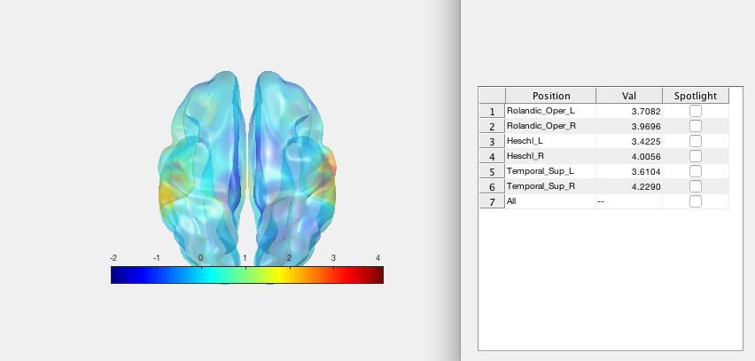

# SourceMesh Features

Plot MEG/EEG functional overlays, networks (nodes & edges) and more on template brains in matlab.

Provide data along with it's sourcemodel coordinates (from, e.g. fieldtrip), use the default AAL90 vertices or define a sourcemodel based on a nifti volume.

Extract iso surfaces from nifti volumes or plot statistical nifti volumes on surfaces.

Plot Gifti surfaces and overlays.

Read & write .edge and .node files.

Export 3D images in 3D file formats VRML and STL.

Transform data into atlas space (AAL90/78/58) and add labels.

Automatically label peaks in functional overlays and show interactively.

Export stationary (camera rotation) and temporal (function over time) videos.

# How it works

Essentially it fits the sourcemodel co-ordinates (or atlas source coords) to an MNI-space gifti surface (or template brain mesh) and allows plotting of functional overlays, nodes, labels, networks (opt. with labels) and overlay-videos on this mesh. 

It can also add atlas labels to non-atlas sourcemodel data using ICP to align the cloud points. 
Can export (after alignment / interpolation) both structural and functional gifti objects.

Includes some compiled cpp code as (linux) mex for speed up for Mac and Linux. If these cause problems, delete them.

*UPDATE: Can export meshes with overlays and networks as .stl and .wrl objects. See example interactive here: https://sketchfab.com/models/9c34500206f641c5a4445dd9d53b7b3e

Usages/Help:


# MESHES:

%  % Plot the default template mesh:
%  atemplate()         

%  % Plot a supplied (gifti) mesh:
%  atemplate('gifti',mesh)   

%  % Plot mesh & write out gifti:
%  atemplate('gifti',mesh, 'write',name);  
  
%  % Plot mesh from nifti volume:
%  atemplate('mesh','mymri.nii')


# OVERLAYS:

%  % Plot template mesh with overlay from AAL90. L is [90x1]
%  atemplate('overlay',L);   

%  % Plot template with overlay values L at sourcemodel values sormod, interpolated on surface.
%  % Sormod is n-by-3, L is n-by-1.
%  atemplate('sourcemodel',sormod,'overlay',L)  

%  % Plot the supplied gifti mesh with overlay values L at sourcemodel locations 
%  % sormod interpolated on surface. 
%  % Sormod is n-by-3, L is n-by-1.
%  atemplate('gifti',mesh,'sourcemodel',sormod,'overlay',L)  

%  %  - Plot as above but write out TWO gifti files:
%  %  1. MYGifti.gii is the gifti mesh 
%  %  2. MYGiftiOverlay.gii is the corresponding overlay data
%  atemplate('gifti',mesh,'sourcemodel',sormod,'overlay',L,'write','MYGifti')  

%  % Plot overlay from nifti volume
%  atemplate('overlay','overlay_volume.nii')

%  *Note on sourcemodel option: Some fieldtrip sourcemodels have x & y
%  swapped (?), undo by doing sm = [sm(:,2),sm(:,1),sm(:,3)];

%  % Co-register the surfaces of the nii volumes in mesh and overlay,
%  % put in aal90 space and add labels:
%  atemplate('mesh',t1.nii,'overlay',functional.nii,'template','aal90','labels')

%  % Put overlay in AAL space and use interactive 'peaks' (clickable)
%  atemplate('sourcemodel',sormod,'overlay',overlayvector,'template','aal90','peaks')




# VIDEO OVERLAY:

%  % Plot a video overlay and write it out:
%  atemplate('gifti',g,'sourcemodel',sormod,'video',m,'name',times); 
%
%  % Where:
%  - g      = the gifti surface to plot
%  - sormod = sourcemodel vertices
%  - m      = overlay values [vertices * ntimes] 
%  - name   = video savename
%  - times  = vector of titles (time values?)


# NETWORKS:

%  % Plot template mesh with 90x90 AAL network, A:
%  atemplate('network',A); 

%  % Plot network A  at sourcemodel locations in 'sormod'. 
%  % Sormod is n-by-3, network is n-by-n.
%  atemplate('sourcemodel',sormod,'network',A);  

%  % As above but writes out .node and .edge files for the network, and the gifti mesh file.
%  atemplate('sourcemodel',sormod,'network',A,'write','savename'); 

%  % Plot network defined by .edge and .node files:
%  atemplate('network','edgefile.edge');

# Project to ATLAS

%  % Put overlay into atlas space: [choose aal90, aal78 or aal58]
%  atemplate('sourcemodel',sormod,'overlay',o,'template','aal58')

%  % Put network into atlas space: 
%  atemplate('sourcemodel',sormod,'network',N,'template','aal78')

%  % Put video into atlas space: 
%  atemplate('sourcemodel',sormod,'video',m,'name',times,'template','aal78')


# OTHER:

%  % Export 3D images (overlays, meshes, networks) as VRML & .stl:
%  atemplate( ... ,'writestl','filename.stl');
%  atemplate( ... ,'writevrml','filename.wrl');


%  % Plot default AAL90 node labels on default mesh:
%  atemplate('labels');         

%  % Plot specified labels at centre of roi's specified by all_roi_tissueindex:
%  atemplate('labels', all_roi_tissueindex, labels); 
%
%  % Where:
%  % all_roi_tissue = a 1-by-num-vertices vector containing indices of the
% roi this vertex belongs to
%  % 'labels' = the labels for each roi. 
%  % The text labels are added at the centre of the ROI.
 
 Labels notes:
     - If plotting a network, only edge-connected nodes are labelled.
     - If plotting a set of nodes (below), only those are labelled.
     - Otherwise, all ROIs/node labels are added!

%  % Plot dots at node==1, i.e. N=[90,1]:
%  atemplate('nodes', N);             

Any combination of the inputs should be possible.
See scripts in 'Examples' folder for more help.

A basic interface (limited functionality over command line version).


# AN EXAMPLE NETWORK (1): from 5061 vertex sourcemodel with AAL90 labels

% load New_AALROI_6mm.mat          % load ft source model, labels and roi_inds
% net  = randi([0 1],5061,5061);   % generate a network for this sourmod
% pos  = template_sourcemodel.pos; % get sourcemodel vertices
% labs = AAL_Labels;               % roi labels
% rois = all_roi_tissueindex;      % roi vertex indices
% atemplate('sourcemodel',pos,'network',net,'labels',rois,labs);

# AN EXAMPLE NETWORK (2): from volume and node/edge files, put in aal58 space:

% atemplate('mesh',t1.nii,'network','test_sourcemod.edge','template','aal58')

See also: slice3() slice2()


# Installation 
addpath to wherever the toolbox is:
```
addpath(genpath('~/Downloads/MeshAAL-master'));
```

Dependencies: fieldtrip & spm

# Other Examples


# in development:
add a set of tracks, as loaded with along-tract-stats toolbox
```
atemplate('gifti',g,'tracks',tracks,header);
```


